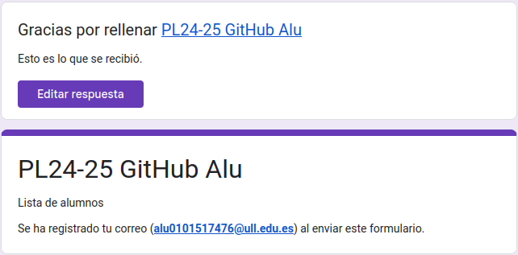
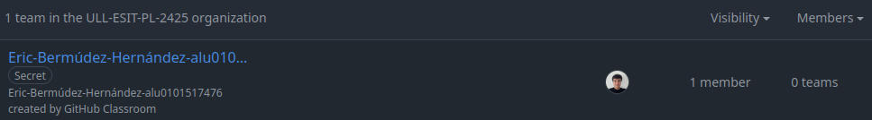
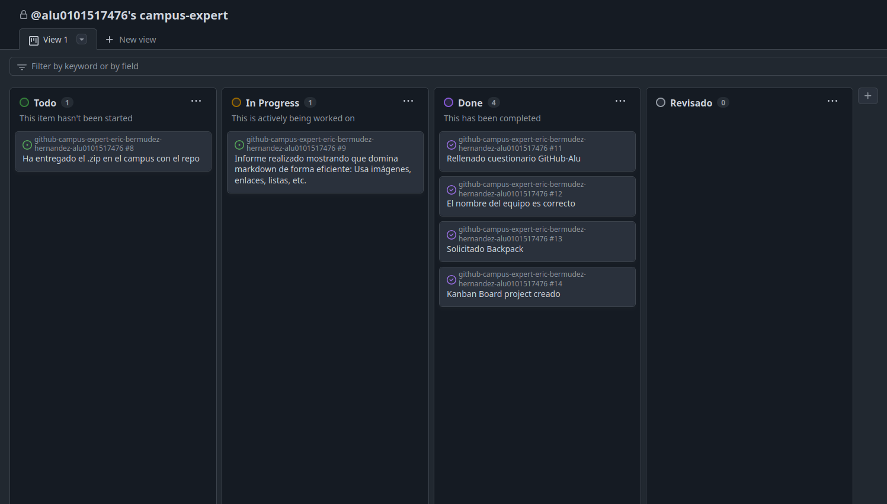
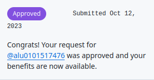

# Github Campus Expert 

- Eric 
- Bermúdez Hernández
- alu0101517476

## Rellenar el cuestionario GitHub-Alu del campus virtual y recibir el correo confirmándolo

## Crear equipo con nombre correcto

## Crear un project board kanban para este repositorio

## Solicitar el GitHub Backpack
Anteriormente ya había soplicitado el Github Backpack, por lo que al volver a intentar solicitarlo, aparece lo siguiente: 

